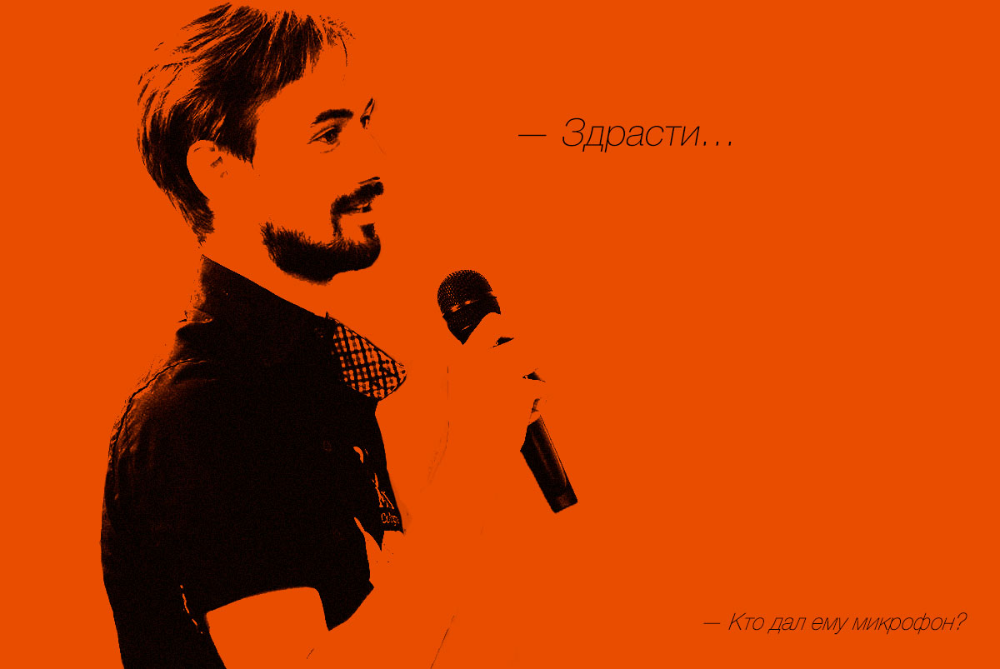
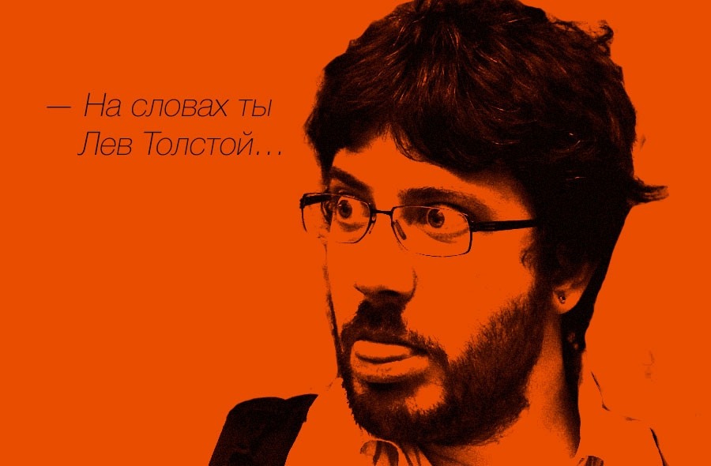
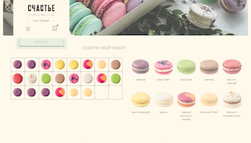
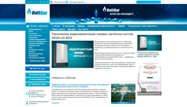
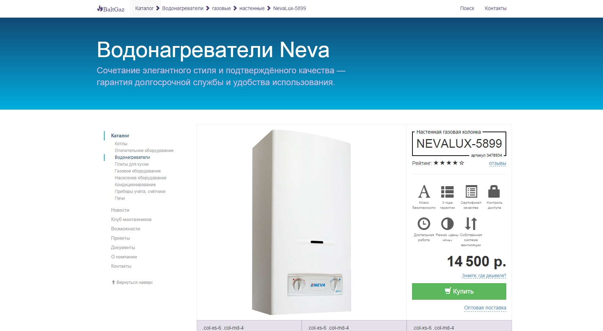
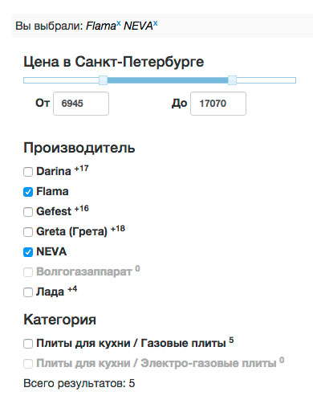
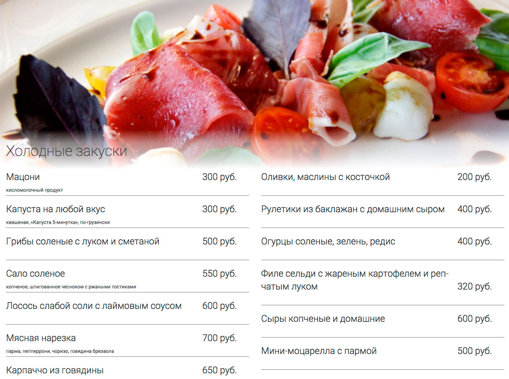
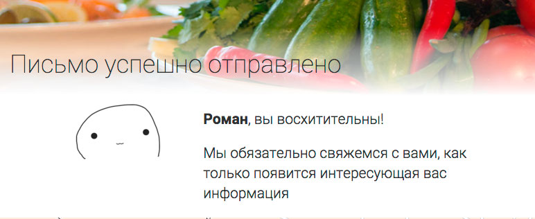
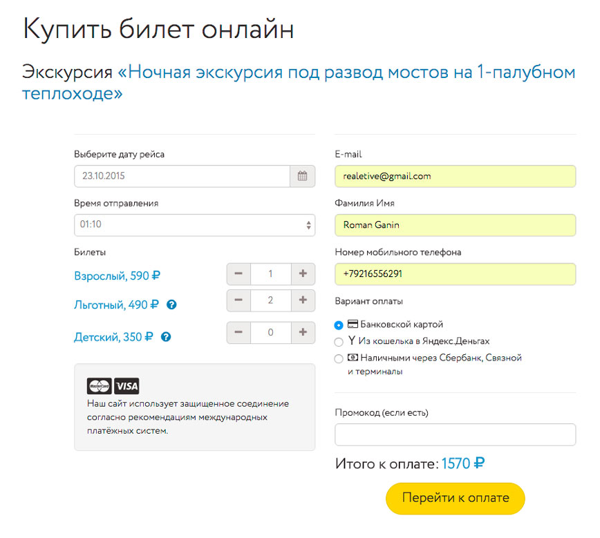
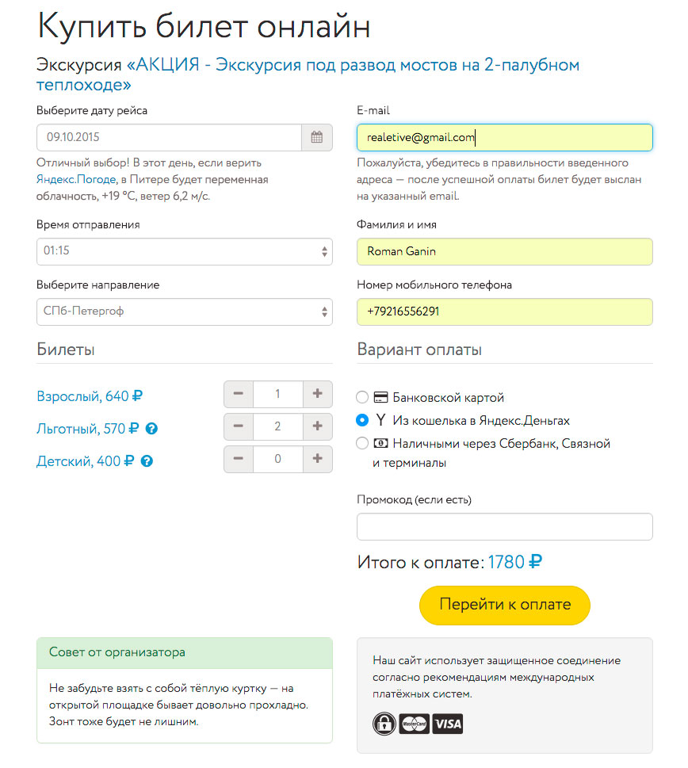

Привет! Меня зовут Роман, я — разработчик интерфейсов с 5-летним стажем.

> — Мои поклонники часто спрашивают меня: «Кто вы такой? И почему вы называете нас вашими поклонниками?»

## Достижения:

* MODX Ambassador в России;
* руководитель санкт-петербургского клуба разработчиков MODX;
* активный участник и докладчик сообществ:
  * SPB Frontend — о типографике в вебе https://vk.com/spb_frontend_meetup_130416,
  * Веб-стандартов — о теге *&lt;head&gt;* [в Питере](https://wsd.events/2016/10/01/) и [Киеве](https://wsd.events/2016/11/26/),
  * PiterCSS;
* соавтор коллективного Твиттер-аккаунта верстальщиков [@cssunderhood](//cssunderhood.ru/Realetive/)</a>;
* организатор на слёте разработчиков Санкт-Петербурга IT Global MeetUp (Piter United)…

На сегодняшний день основным направлением моей профессиональной деятельности является __фронтенд__:
* разработка на полном БЭМ-стеке;
* уверенное использование Adobe Photoshop и Illustrator, сейчас перешёл на Sketch 3;
* Web perfomance во всех её проявлениях:
  * HTTP2, gzip;
  * кэширование и его инвалидация;
  * заголовки Last-Modifed, Expires headers, E-tag, Cache-Control, Vary: Accept-Encoding header;
  * CSS-спрайты;
  * кодирование изображений в base64, inline SVG;
  * core CSS;
  * объединение скриптов и стилей в одни файлы, их минификация (+ HTML);
  * оптимизация загрузки шрифтов (WOFF и localStorage);
  * «ленивая» загрузка;
  * `defer` для сторонних скриптов;
  * по возможности асинхронно подгружать контент, невидимый при первоначальной загрузке (напр. неактивные вкладки табов, содержимое «аккордионов» и «каруселей»);
  * использование CDN (именно CDN, а не поддомен, откуда подгружаются все картинки, скрипты и стили);
  * сокращение числа запросов к серверу;
  * атрибуты высоты и ширины у ``;
  * оптимизация изображений + webP и многое другое, чего я сейчас, может, с ходу и не вспомню. Хотя и это далеко не полный список.
* вёрстка, подразумевающая:
  * соответствие макету, хотя в последнее время чаще приходится работать с собственным карандашным наброском ввиду стремительного уменьшения толковых web-дизанеров;
  * кроссбраузерность, т. е. ≥IE8, но с Opera Mini (плюсик Вадиму Макееву);
  * кодировка и DOCTYPE;
  * независимость блоков в CSS: минимизация каскада, использование техник БЭМ;
  * если это не mobile first, то сайт должен нормально смотреться во всех стандартных разрешениях от 1024 пикселей и выше. Мобильная версия (или адаптивная) не должна иметь горизонтального скролла, при этом вписываться в экран мобильных устройств;
  * корректная работа при вбивании реального текста, надёжность вёрстки, проверка на [«одиннадцатиклассницу»](//habrahabr.ru/company/2gis/blog/246831/);
  * CSS должен быть написан с использованием процессоров, за вендорный префиксы отвечает Autoprefixer;
  * наличие Win/Mac/Linux-аналогов шрифтов;
  * доступность при выключенных (загружающихся) картинках;
  * HTML5 формы, линковка, валидация;
  * семантичность. Отсутствие глупостей в HTML и CSS, единообразие, аккуратность;
  * правильная структура заголовков (H1—H6 и TITLE);
  * работоспособность при выключенном (незагруженном) JavaScript;
  * работоспособность при выключенном Flash;
  * отсутствие багов при увеличенном шрифте;
* организация:
  * использование линтеров кода (CSSLint и JSHint + ESLint);
  * CCSComb;
  * PostCSS-initial и PostCSS-autoreset;
  * Style Guide, (самогенерируемые) руководства по стилям, например SC5 и KSS.

## Что знаю и практикую:

* CMF MODX, создание компонентов и, как следствие, ExtJS («ложка дёгтя»);
* CSS-процессоры: LESS, SASS, PostCSS;
* Bower, npm и Yeoman;
* сборщики проектов Gulp и ENB;
* Vagrant, puppet, ansible;
* считаю, что Progressive Enhancemen лучше чем Graceful Degradation;
* опыт работы с API: Google Maps, Google Calendar, Google Translator, Google OAuth2, Яндекс.Карты, Яндекс.Паспорт, Яндекс.Переводчик, Яндекс.Маркет, Twitter, VK OAuth, OpenStreetMaps, Spotify.

## Используемое ПО

* Chrome DevTools;
* основной редактор: Sublime Text 3, опционально — phpStorm и Vim;
* командная строка: iTerm2 + zsh;
* виртуализация и экспериментальные окружения: VirtualBox + Vagrant (+ puppet/ansible);
* прототипирование мобильного интерфейса: Xcode + Quartz Comboser + Facebook Origami;
* гарант хорошего настроения: Spotify.

## Что изучаю:

* ES6;
* Webpack;
* ReactJS.

## Что не хочу или не планирую изучать:

> Индусские фрилансеры — главная причина моего нулевого рейтинга на UpWork

* EmberJS (потому что есть ReactJS), Angular;
* Symphony, Yii (потому что есть MODX (+ xPDO), Laravel, Phalcon);

## Основные принципы

Я упарываюсь по типографике и юзабилити. Я вообще часто упарываюсь. Так говорят мои коллеги, но мне так не кажется. То есть, я считаю, что фронтенд-разработчик — это не только Twitter Bootstrap и jQuery. По крайней мере я различаю тире («-») и дефис («—»), кавычки (« ») и знак дюйма ("), неразрывный пробел (`&nbsp;`) и тонкая шпация (`&thinsp;`). Я пропогандирую __em__, если это уместно, потому что это оправдано. А с [недавнего времени](https://twitter.com/Realetive/status/636054197880909824) ещё и БЭМ. Я спорю с дизайнерами, когда их макеты «сыпятся» при изменении ширины или поле с именем не выдерживает кого-то «длиннее», чем John Doe, или заголовок, содержащий не «Lorem ipsum dolor…», а что-нибудь типа «Комсомольская правда: „[В Новгородской области поставили памятник Цою, который запретили устанавливать в Петербурге](//www.kp.ru/daily/26447/3317565/)“».

## Примеры работ

> ### Это всё, что останется после меня…
> — Юрий Шевчук

Чаще всего я работаю один, поэтому, хоть и с Git работаю регулярно, пушы делаю крайне редко, поэтому вполне довольствуюсь локальной СКВ. Но, на всякий случай:

* GitHub: [@Realetive](https://github.com/Realetive)
* Bitbucket: [@Realetive](https://bitbucket.org/Realetive/)

По крайней мере по застаренным на GitHub можно понять, чем я всё же интересуюсь.

Из последних работ (на каждую из которых ушло несколько месяцев), которые работают и приносят прибыль моим клиентам:

|  |      |
|--------------------------------------------------------------------|------------------------------------------------------------|
| Лавка Счастья                                                      | Балтийская газовая компания                                |
|                |  |
| Загородный ресторан Runo.RU                                        | Экскурсии по рекам и каналам Санкт-Петербурга              |

#### [Лавка Счастья](https://lavkaschastya.com)

Фулстек-разработка от создания прототипов до вёрстки и бэкенда. Имиджевый интернет-магазин, расчёт стоимости доставки по регионам, ручной набор товаров в коробке drag'n'drop'ом, личный кабинет, админка.

* сборка на TARS;
* Jade;
* PostCSS;
* клиентская и серверная оптимизация изображений;
* оптимизация серверной части, кэширования.

__Отличный визуальный лонгрид сделал автор дизайна, Сергей Борцов, в своём профиле на Behance:__ https://www.behance.net/gallery/47128771/Online-store-for-confectionery-HAPPINESS.

#### [Балтийская газовая компания](//baltgaz.ru)

Помимо новостного портала сайт имеет два крупных подраздела: интернет-магазин и закрытую CRM-систему СРОП для контроля региональных дистрибьюторов (многоуровневый доступ для сотрудников компании и дистрибьюторов). Отдельно развивается «Клуб монтажников».

#### Основной портал

Полнотекстовый поиск, мультиязычность. В процессе работы с проектом была создана (не реализована в действующей версии) модель единой эко-системы основного портала с интернет-магазином, СРОП'ом и клубом монтажников.

#### Магазин

Фасетный поиск по товарам, мультикатегории (товар может находиться в нескольких категориях), синхронизация с базой данных 1С, различные цены в зависимости от региона (мультирегиональность), выгрузка товаров в Яндекс.Маркет, экспорт товаров из Excel.

|  |
| :--: |
| Концепция нового дизайна карточки товара |

|  |
| :--: |
| Мультирегиональность |

|  |
| :--: |
| Пример фасетного поиска |

#### [Загородный ресторан Runo.RU](//runo.spb.ru)

Создание дизайна, прототипирование, вёрстка, панель управления публикациями, меню блюд, фото и видеогалереей, формой обратной связи и других разделов. Поисковая оптимизация (техническая часть). Настройка сервера (nginx + php-fpm).
Используемые инструменты/технологии:

* сборка на Gulp;
* postcss/autoprefixer;
* SASS;
* UI тестирование с BrowserSync;
* A/B-тесты на повышение лояльности к бренду;
* серверная (Munee) и клиентская минификация стилей (csso), скриптов (uglify);
* автогенерация Favicons;
* клиентская и серверная минификация изображений.

|  |
| :--: |
| Принцип построения структуры меню основывался на реальной типографической вёрстке |

|  |
| :--: |
| Правильное сопровождение полей формы обратной связи увеличило конверсию в 3 раза |

|  |
| :--: |
| Пример карты эмпатии — сообщение, получаемое пользователем при заполнении формы обратной связи |

#### [Экскурсии по рекам и каналам Санкт-Петербурга](https://nevatrip.ru)

Система онлайн платежей (Яндекс.Касса).
Сейчас проект переписывается на полный БЭМ-стек с улучшенной адаптацией под мобильные устройства и оптимизацией скорости загрузки, мультиязычностью, новой бизнес-логикой и системой заказов.

|  |
| :--: |
| До: резкое «приклеивание» меню при скроллинге |

|  |
| :--: |
| После: переход плавный и без задержек |

|  |
| :--: |
| Текущий пример формы заказа |

|  |
| :--: |
| Новый пример формы заказа |

#### Прочие

Есть и другие проекты, но, к сожалению, значительная их часть уже не существует (в примерном хронологическом порядке начиная с новых):

1. теплоходные экскурсии по Москве-реке [moskvatrip.ru](https://moskvatrip.ru) и автобусные экскурсии по Питеру [busguide.ru](https://busguide.ru);
1. аренда кафе под корпоратив на Новый год, [fdfp2016.ru](//fdfp2016.ru);
2. сайт организаторов интелектуальной барной викторины, [mozgoboj.ru](//mozgoboj.ru);
3. интерфейс к сервису эвакуации автомобилей [sparxcloud.ru](//sparxcloud.ru) (https://bitbucket.org/Realetive/sparx_partner);
3. студия света [illuminato.ru](//illuminato.ru);
5. 3D-мюзикл «Джульетта и Ромео»: [jumeo.ru](//jumeo.ru);
4. Пола Негри (тут сопровождение, не создание): [polanegri.ru](//polanegri.ru);
6. сайт ребят, которые эти мюзиклы делают: [letpro.ru](//letpro.ru);
7. каталог швейных товаров Петронить: [petronit.ru](//petronit.ru);
8. эвент-агенство Слон-салон (адрес неизвестен);
9. закрытая разработка CRM-системы для сети кофеен «Чайникофф»;
10. строительная компания АльфаТраст: [alphatrust.ru](//alphatrust.ru). Они вернулись к старому дизайну, т. к. мы прекратили сотрудничество;
11. персональный сайт художниц: [artiswall.ru](//artiswall.ru);
12. персональный сайт актрисы Виктории Баркановой: был на [barkanova.com](//barkanova.com), но, по всей видимости, отключен;
13. театр балета им. Ейфмана: так и не выгрузили новую версию, так что там старая;
14. рекламное агенство BVMedia: [bvmedia.ru](//bvmedia.ru) (на сколько я знаю, их больше не существует). Помимо основного портала, создание CRM-системы по контролю всех рекламных площадей компании;
15. выставка-ярмарка «Хобби 21 век»: [hobby21vek.com](//hobby21vek.com) (дочерний проект bvmedia.ru). Каталог участников, их личные кабинеты;
16. общество защиты прав потребителей России: [finpotrebsouz.ru](//finpotrebsouz.ru). Из-за недостатка финансирования пришлось прекратить сотрудничество: полный редизайн и новая бизнес-логика, панель управления с разделением прав доступа, система технической поддержки, интерактивная карта на Raphael.JS;
17. студия эротики Ромео: [romeo-studio.ru](//romeo-studio.ru);
18. эскорт-агенство girlsfor.travel (остался только в исходнике);
19. финансовое бюро «Кредитный Папа»: [kredpapa.ru](//kredpapa.ru) (дела у компании пошли не очень, так что пришлось закрыть, а жаль — сайт был очень крутой);
20. свадебное агенство LaFamilia: тоже только в исходниках;
21. интернет-каталог [6424478.ru](//6424478.ru);
22. финансовое бюро МаксФинанс (адрес неизвестен);
23. шоу-рум «Шу-шу»: [mon-chou.ru](//mon-chou.ru);
24. креативное агенство [polempole.ru](//polempole.ru);
25. [etonauka.com](//etonauka.com)…

…ещё какие-то работы есть, но я их уже не помню. Или они утеряны…
